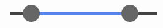

2023.01.24  
Tomoya Onuki  

# onUI
The onUI is a library that allows you to easily design UI components by simply adding classes to html. You don't need to write javascript code.

## Reference
https://tomoya-onuki.github.io/onUI/

# Usage
Just load the CSS and JS, and write the <onui> element.
```html
<head>
    <link rel="stylesheet" href="onui.css">
    <script src="onui.js"></script>
</head>

<body>
    <onui></onui>
</body>
```

## Toggle Switch
<br>
```html
<onui type="toggle-switch" id="toggle"></onui>
<label for="toggle">Toggle Switch</label>
```

## Toggle Button
<br>
```html
<onui type="toggle-btn">Toglle Button</onui>
```

## Multi Slider
<br>
```html
<onui type="range"></onui>
```

## Font Selector
<br>
```html
<onui type="font">
    <option name="sans-serif"></option>
    <option name="serif"></option>
    <option name="Arial"></option>
    <option name="Times New Roman"></option>
</onui>
```

## Accordion Menu
<br>
```html
 <onui type="accordion">
    <option name="ac-item0" value="item0"></option>
    <option name="ac-item1" value="item1"></option>
    <option name="ac-item2" value="item2"></option>
</onui>
<div id="ac-item0">sample0 sample0 sample0 sample0 sample0</div>
<div id="ac-item1">sample1 sample1 sample1 sample1 sample1</div>
<div id="ac-item2">sample2 sample2 sample2 sample2 sample2</div>
```

## Tab Menu
<br>
```html
<onui type="tab">
    <option name="tab-item0" value="item0"></option>
    <option name="tab-item1" value="item1"></option>
    <option name="tab-item2" value="item2"></option>
</onui>
<div id="tab-item0">sample0 sample0 sample0 sample0 sample0</div>
<div id="tab-item1">sample1 sample1 sample1 sample1 sample1</div>
<div id="tab-item2">sample2 sample2 sample2 sample2 sample2</div>
```


# License
The source code is licensed MIT. The website content is licensed CC BY 4.0,see LICENSE.